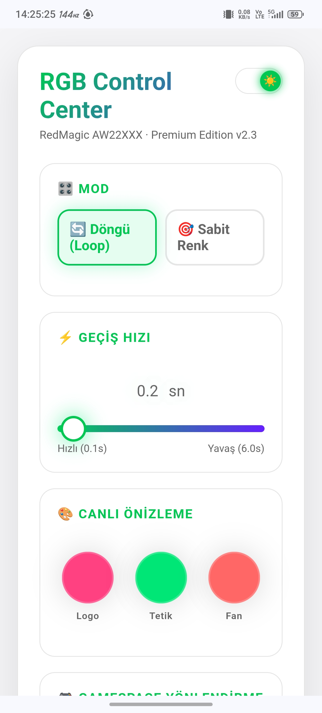
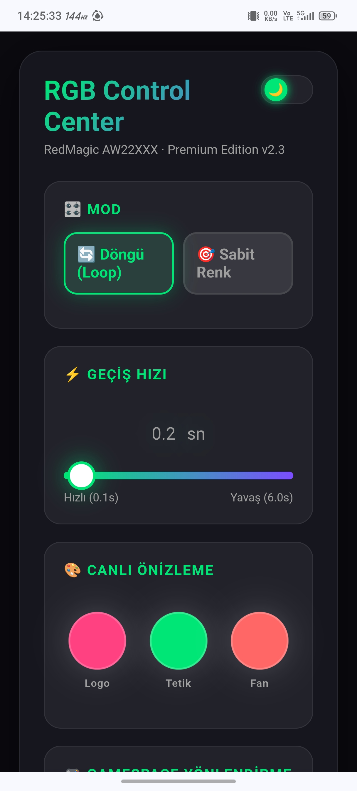
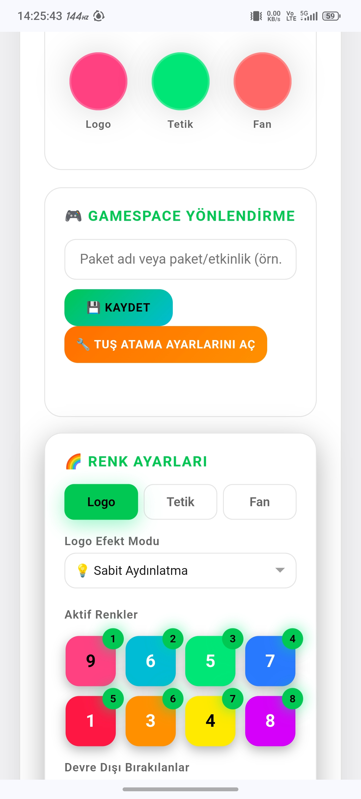
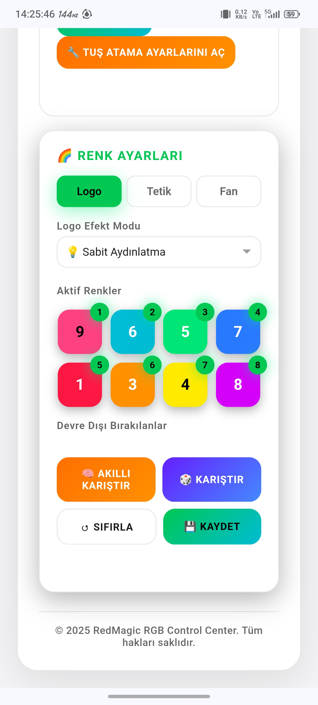
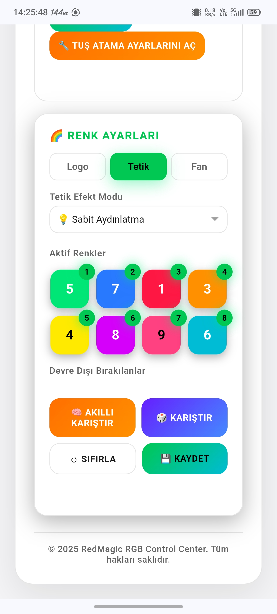
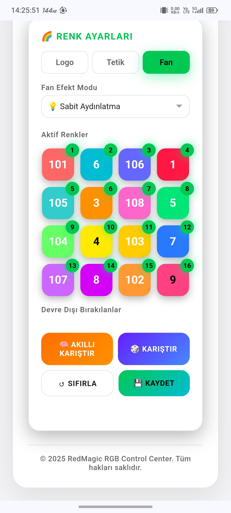
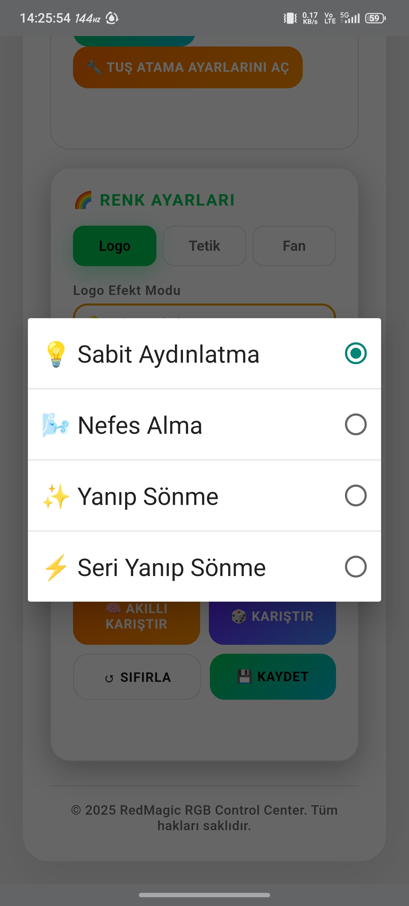
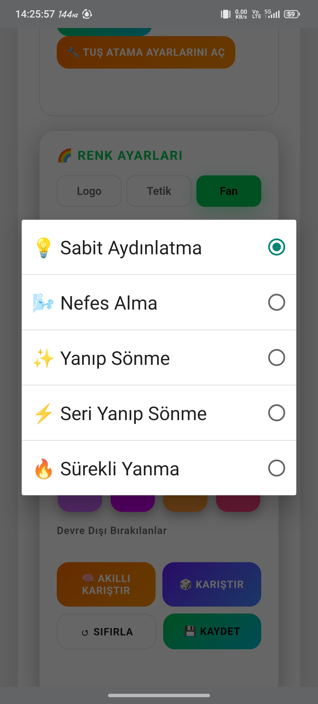

## Screenshots

### Main UI







### RGB COLORS





### RGB EFFECTS







> RedMagic RGB Control Center Web UI

# RedMagic AW22XXX RGB Control Center

## Description
This KernelSU (KSU) module provides comprehensive RGB lighting control for RedMagic devices equipped with the AW22XXX LED controller. It synchronizes the logo, shoulder trigger, and cooling fan LED zones with dynamic color cycling, per-zone effect modes, GameSpace key redirection, and **liquid cooling pump synchronization**.

The built-in **KernelSU Web UI** allows real-time configuration of:
- Loop / Static modes
- Transition speed (0.1s – 6.0s)
- Per-zone color sequences (Logo, Trigger, Fan)
- Per-zone LED effects (Static, Breathing, Blinking, Fast Blinking, Continuous Glow)
- Fan-exclusive extended color palette (16 colors)
- GameSpace hardware key target app selection
- **Liquid cooling pump control (automatic, synchronized with LEDs)**

All settings are saved persistently in `/data/adb/` and survive reboots.

## Features
- **Synchronized RGB cycling** across all three LED zones.
- **Independent per-zone control**:
  - Logo & Trigger: 8 standard colors
  - Fan: 8 standard + 8 extended colors (16 total)
- **Per-zone effect modes**:
  - Logo / Trigger: Static, Breathing, Blinking, Fast Blinking
  - Fan: Static, Breathing, Blinking, Fast Blinking, Continuous Glow
- **GameSpace key redirection**:
  - Detects the physical GameSpace switch (`gpio-keys_nubia`)
  - Kills GameSpace and launches the user-selected target app
  - Target app can be **manually entered via Web UI** or selected from the app list
- **Liquid cooling pump synchronization**:
  - Pump turns on when RGB lighting is active
  - Pump recovers together with the fan if a temporary LED shutdown occurs
  - Pump turns off only when all LED zones are off (true shutdown)
  - Controlled via `/proc/driver/micropump/enable` and `settings put system liquid_cooling_off_on`
- **Music awareness**:
  - Prevents LED shutdown while media is playing
  - Fan and pump automatically recover if temporarily disabled during music
- **Game LED detection**:
  - Automatically restores LED behavior after game-controlled shoulder LEDs are released
- **Smart shutdown detection**:
  - Turns off all LEDs when all three zones receive shutdown signals
- **Wakelock management**:
  - Holds wake lock only while LEDs are active
- **Dynamic config reload**:
  - All settings are re-read every 10 cycles without restarting the script
- **Performance optimization**:
  - Uses `/sys/class/leds/aw22xxx_led/effect` as primary path with automatic fallback
  - Runs with `-10` process priority for smoother operation

## Prerequisites
- Rooted RedMagic device
- **KernelSU (KSU)** installed (Magisk works for core script, but Web UI requires KSU)
- Hardware must use `aw22xxx_led` I2C controller path:
  `/sys/devices/platform/soc/ac0000.qcom,qupv3_1_geni_se/a94000.i2c/i2c-5/5-006a/leds/aw22xxx_led/effect`
- **Micropump path (optional):** `/proc/driver/micropump/enable`

## Installation
1. Download the `.zip` module file.
2. Open **KernelSU** manager.
3. Go to **Modules** → **Install**.
4. Select the downloaded `.zip`.
5. Reboot the device.
6. After reboot, open KernelSU → Modules → tap module name to access Web UI.

## Web UI
The Web UI includes:
- Mode selector (Loop / Static)
- Speed slider (0.1s – 6.0s)
- Live preview circles for each zone
- Per-zone tabs with:
  - Effect mode dropdown
  - Active / disabled color chips
  - Smart shuffle, random shuffle, reset, save buttons
  - Static color selection
- GameSpace redirection section:
  - Manually enter target app package name
  - Load installed app list (searchable)
  - Select target app (stored in `/data/adb/gamespace_target.txt`)

## File Structure
```

/data/adb/redmagic_rgb_mode.txt
/data/adb/redmagic_rgb_speed.txt
/data/adb/redmagic_rgb_colors_1.txt
/data/adb/redmagic_rgb_colors_2.txt
/data/adb/redmagic_rgb_colors_3.txt
/data/adb/redmagic_rgb_static_1.txt
/data/adb/redmagic_rgb_static_2.txt
/data/adb/redmagic_rgb_static_3.txt
/data/adb/redmagic_rgb_effect_1.txt
/data/adb/redmagic_rgb_effect_2.txt
/data/adb/redmagic_rgb_effect_3.txt
/data/adb/gamespace_target.txt

```

## Compatibility & Testing
**IMPORTANT:** This module has been developed and strictly tested **only on the RedMagic 11 Pro**.
- It has **not** been tested on other RedMagic models or different smartphone brands.
- Hardware paths and LED controllers may differ across device generations; compatibility with other models is unknown.

## Disclaimer & Warning
**USE AT YOUR OWN RISK.**
- This module interacts directly with low-level kernel sysfs nodes and hardware controllers.
- By installing this module, you acknowledge full responsibility for any potential consequences.
- The creator assumes **no liability** for hardware damage, software bricking, system instability, LED component failure, or any other technical malfunction.
- This project was created purely for **educational and research purposes** to understand I2C controller behavior. It is not intended for malicious use*   **Persistent Settings:** Your preferred speed setting is saved directly to root memory (`/data/adb/`) and remains active after restarting the device.

## Prerequisites
*   A rooted RedMagic device.
*   **KernelSU (KSU)** installed and functional (Magisk can be used for the core script, but the Web UI control specifically requires KernelSU).
*   The device hardware must utilize the `aw22xxx_led` I2C controller path (`/sys/devices/platform/soc/.../leds/aw22xxx_led/effect`).

## Installation Instructions
1.  Download the provided `.zip` module file.
2.  Open the **KernelSU** manager application.
3.  Navigate to the **Modules** tab.
4.  Tap **Install** and select the downloaded `.zip` file.
5.  Wait for the flashing process to complete.
6.  **Reboot** the device.
7.  After rebooting, open the KernelSU app, navigate to Modules, and tap on this module's name to access the Web UI speed slider.

## Compatibility & Testing
**IMPORTANT:** This module has been developed and strictly tested **only on the RedMagic 11 Pro**. 
*   It has **not** been tested on other RedMagic models or different smartphone brands.
*   The hardware paths and LED controllers may differ across device generations; therefore, compatibility with other models is entirely unknown. 

## Disclaimer & Warning
**USE AT YOUR OWN RISK.**
*   This module interacts directly with low-level kernel sysfs nodes and hardware controllers. 
*   By installing this module, you acknowledge that you take full responsibility for any potential consequences.
*   The creator assumes **no liability** for any hardware damage, software bricking, system instability, LED component failure, or any other technical malfunction that may occur.
*   This project was created purely for **educational and research purposes** to understand I2C controller behavior. It is not intended for malicious use.
